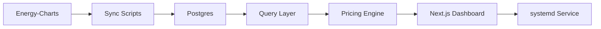

# Architecture

## Overview

`kilab-webapp` is a local full-stack Next.js application that turns German quarter-hour electricity market data into a household-facing decision dashboard.

The architecture is intentionally compact:
- data ingestion scripts fetch market prices
- Postgres stores normalized series and sync metadata
- pricing logic derives local end-customer scenarios
- the Next.js app renders a decision-focused dashboard from the stored data

## System Shape

Main building blocks:
- `Next.js App Router`
  - page shell and dashboard rendering
- `Postgres`
  - market price storage and sync run history
- `Sync scripts`
  - backfill and recurring updates
- `Pricing engine`
  - local real-price calculation and monthly estimate logic
- `systemd`
  - persistent production runtime on the container

## Data Flow

1. External market prices are pulled from Energy-Charts.
2. Import logic normalizes quarter-hour records.
3. Data lands in `market_price_series`, `market_price_points`, and `sync_runs`.
4. Query logic assembles chart rows and current values.
5. Pricing logic adds local Schwaebisch-Hall-specific modelling.
6. The dashboard renders:
   - raw market prices
   - real-price scenarios
   - monthly projection
   - flex-vs-fix guidance
   - best upcoming windows

## Core Concepts

### Day-Ahead
Primary market reference for the dashboard and the real-price scenarios.

### Intraday
Secondary reference line for additional market context.

### Real Price
Derived household-facing price that includes more than the exchange value:
- procurement layer
- local network fees
- taxes and levies
- meter / scenario differences

### Fixed Price Reference
A user-facing comparison anchor:
- `25 ct/kWh`
- `12 EUR/month` assumed base fee

### Monthly Projection
The dashboard scales observed prices against a `BDEW H0` monthly load profile for a `3-person house` and `3,500 kWh/year`.

## Runtime Model

Two runtime modes matter:
- development via `pnpm dev`
- persistent serving via `kilab-webapp.service`

The persistent mode is the operational default on the container.

## Why This Shape

The project intentionally keeps the stack compact:
- one app
- one local database
- one container
- one visible dashboard

That keeps iteration fast while still leaving enough structure for additional data sources and scenario logic later.
